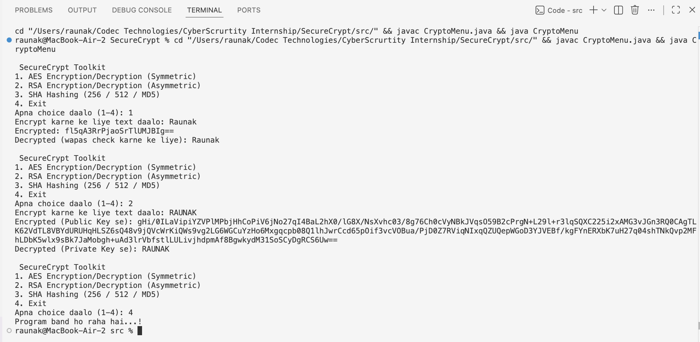

# SecureCrypt - Cryptography Algorithms Implementation (Java)

**Internship:** Codec Technologies - Cybersecurity Internship
**Project:** 1 of 2
**Domain:** Applied Cryptography

## Objective
This is the first project of my Cybersecurity Internship at Codec Technologies. Is project me maine Java ke through 3 important cryptography concepts implement kiye hain - AES (symmetric encryption), RSA (asymmetric encryption), aur SHA (hashing). The goal was to understand the core building blocks of secure communication by implementing them from scratch in code, instead of just reading the theory.

## Tech Stack
- Java (core JDK only - `javax.crypto` and `java.security` packages)
- No external libraries required, everything is built into the JDK

## Project Structure
1. **AESDemo.java** - Symmetric encryption implementation (same key used for both encrypt and decrypt)
2. **RSADemo.java** - Asymmetric encryption implementation (Public key encrypts, Private key decrypts)
3. **SHADemo.java** - Hashing implementation (SHA-256, SHA-512, MD5) - one-way conversion, mainly used for storing passwords securely
4. **CryptoMenu.java** - Saari teeno files ko ek interactive terminal menu me combine kiya hai, taaki ek hi program se sab kuch test ho sake

## How to Run

Run the following commands in the VS Code terminal:
cd src

javac *.java

java CryptoMenu

The menu will open, jisme tum number daal ke AES, RSA, ya SHA me se koi bhi option try kar sakte ho.

To run an individual file directly:
java AESDemo

java RSADemo

java SHADemo

## Key Learnings

- AES and RSA are both encryption algorithms, but their use-cases are different. AES is fast, isliye bade data ko encrypt karne ke liye use hota hai. RSA is comparatively slower, so it is typically used for key exchange or encrypting smaller pieces of data.
- The advantage of RSA having two separate keys is that the public key can be shared with anyone, but only the holder of the private key can decrypt the data - isi tarah HTTPS websites secure connections establish karti hain.
- Hashing and Encryption are not the same thing - this was a misconception I had earlier. Encryption is reversible (can be decrypted), but hashing is strictly one-way. Isi wajah se passwords ko hash karke store kiya jaata hai, encrypt karke nahi.
- MD5 is now considered outdated for security purposes because it is vulnerable to collision attacks, isliye real-world projects me SHA-256 ya usse upar ka algorithm use karna chahiye.

## Future Scope
- File encryption/decryption support can be added (currently it only works on text strings)
- Salting + SHA-256 combo ka demo add kiya ja sakta hai for secure password storage
- Digital signature implementation using RSA

## Internship Context
This project has been developed as part of my **Cybersecurity Internship at Codec Technologies**, under the broader domain of cryptography and secure communication. Ye is internship ka **first project** hai, jisme encryption fundamentals (AES, RSA) aur hashing (SHA) ko practically implement karke samjha gaya hai. The second project of this internship focuses on password cracking and hashing analysis.

## Sample Output

## Author 
Raunak Mishra 